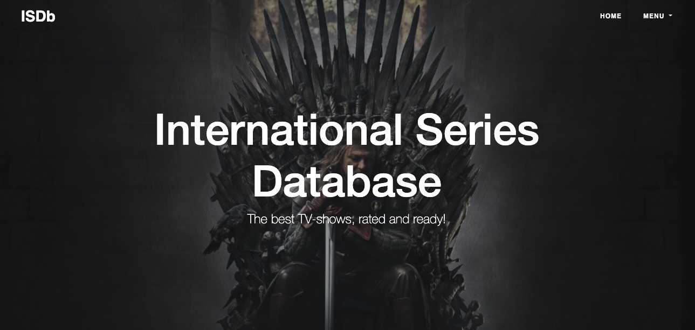
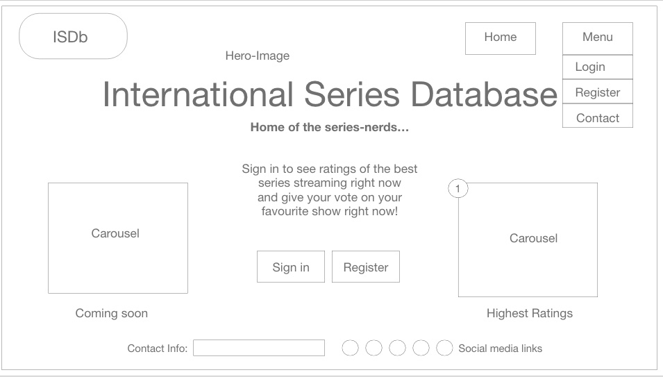
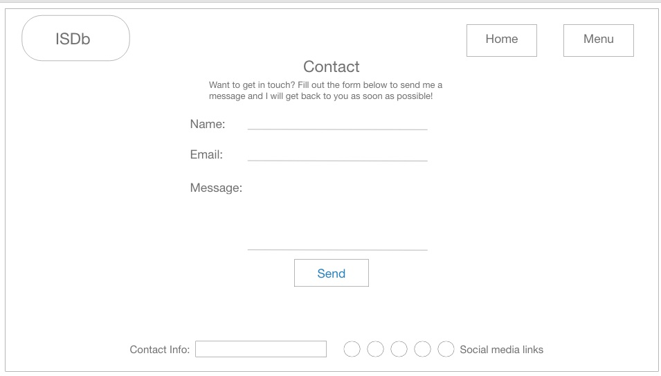
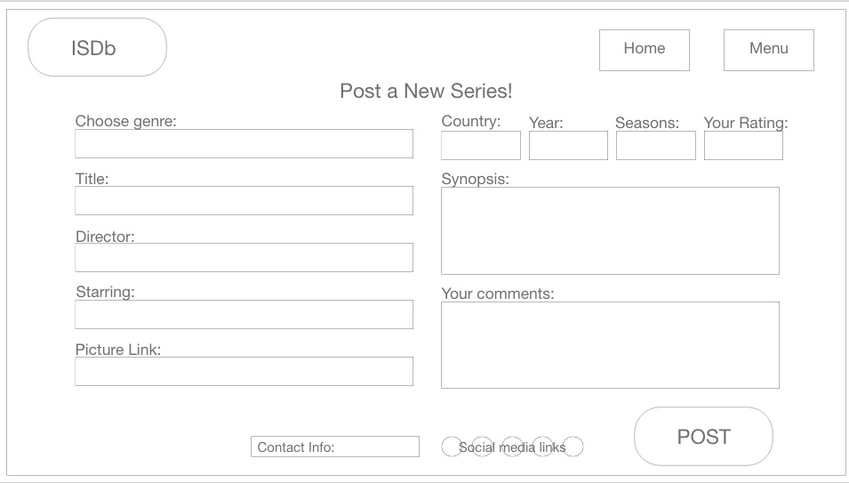
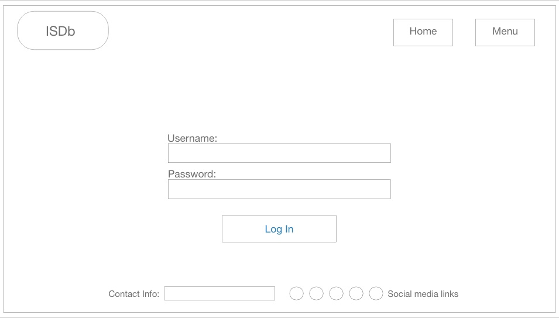

# International Series Database

The International Series Database is the place to go if you want to find a new TV-show to watch and dont know which one to pick. Here you can read read about 
different tv-shows and see other users ratings and read their reviews. If you like you can also help your fellow binge-watcher and post a new show or give your rating
and review of an existing one. View the live Website [here](https://ms3-seriesdb-project.herokuapp.com/).

## Table of Contents
* [User Experience Design (UX)](#User-Experience-Design)
    * [The Strategy Plane](#The-Strategy-Plane)
        * [Site Goals](#Site-Goals)
        * [User stories](#User-Stories)
    * [The Scope Plane](#The-Scope-Plane)
    * [The Structure Plane](#The-Structure-Plane)
    * [The Skeleton Plane](#The-Skeleton-Plane)
        * [Wireframes](#Wireframes)
        * [Database Design](#Database-Design)
        * [Security](#Security)
    * [The Surface Plane](#The-Surface-Plane)
        * [Design](#Design)
            * [Colour Scheme](#Colour-Scheme)
            * [Typography](#Typography)
            * [Imagery](#Imagery)
- [Features](#Features)
    * [Existing Features](#Existing-Features)
    * [Features to be added](#Features-Left-to-add)
* [Technologies](#Technologies)
* [Testing](#Testing)
    * [Test Strategy](#Test-Strategy)
    * [Test Results](#Test-Results)
    * [Issues and Resolutions](#Issues-and-Resolutions-to-issues-found-during-testing)
* [Deployment](#Deployment)
    * [Project Creation](#Project-Creation)
    * [GitHub Pages](#Deployment-To-Heroku)
    * [Run Locally](#Run-Locally)
    * [Fork Project](#Fork-Project)
* [Credits](#Credits)
  * [Content](#Content)
  * [Acknowledgements](#Acknowledgements)

****

## User Experience Design
### **The Strategy Plane**

In the decades since home television was introduced in 1927, there have been many changes. In the beginning 
there wasn’t a way to record a show you missed. You had to be in front of your TV at the exact time the show
was being broadcasted. With the technologies we have today, we as comsumers have a completely new way of 
watching TV. The streaming services have made it possible for you to watch WHAT you like, WHEN you like and
on different devices ranging from large screens to mobile devices. There are almost a countless amount of shows
to choose from today and sometimes it can be hard to pick the right one. We spend a big part of the evening scrolling
through electronic perogram guides on the different streamning services. Now you dont have to anymore.

This website was created to fill the need for the fellow binge-watcher with decision anxiety. The goal is to provide
users with a simple and easy to use website that allows them to find a new show to watch or post a show that can be shared with
other binge-watchers. The user are also able to give ratings and write reviews of the shows that are posted and read the reviews
and ratings made by other users.

#### Site Goals
* Help the users to save time by guiding them to their next show faster, instead of the tedious schrolling of the menues
in electronic program guides.
* Inform the users about the different TV-shows by providing a esasy-to-use website with fast access to the most 
important details about different TV-shows.
* Creating a place where users can share their viewing experience with others through ratings and reviews.

#### User stories
* As a user, I want the main purpose of the site to be clear so that I immediately know what the site is 
intended for upon entering.
* As a user, I want to easily navigate the site so that I can find content quickly with ease.
* As a user, I want the website to be responsive so that I can clearly view the webpages from my mobile, 
tablet or desktop.
* As a user, I want to be able to register to the website so that I can create and manage my watched shows.
* As a user, I want a way to contact the site owner so that I can have any questions I may have in 
regards to the website answered.
<!-- * As a user, I want to be able to return to the main site without having to use the browser buttons so  -->
<!-- that I can easily return to the website if I navigate to a page that doesn't exist. -->
<!--  -->

### **The Scope Plane**

**Features planned:**
* Responsive design.
* Website title and information on the site purpose.
* A clear navigation Menu.
* MongoDB databases to store information about the TV-shows, user login/profile information and information stored from contact form.
* CRUD Functionality
* Login functionality.
* Logout functionality.
* Profile Page
* All the TV-shows displayed on one page for the logged in users.
* The current users own posted shows on the profile page.
* Registered user creation and management of their own posted shows.

### **The Structure Plane**
User Story:
> As a user, I want the main purpose of the site to be clear so that I immediately know what the site is 
intended for upon entering.

Acceptance Criteria:
* Site Logo to be displayed on the main navigation bar on all pages and across all devices.
* Home Page to display Website Title and information to the user on the purpose of the site.

Implementation:

A site logo will be displayed on the main navigation menu. This should be 
displayed on all webpages.

The Website title will be displayed on the home page and a detailed description of the 
site will be displayed on the Home page so that is evident of the websites
purpose as soon as the user visits the site.

User Story:
> As a user, I want to be able to easily navigate the site so that I can find content quickly and with ease.

Acceptance Criteria:
* Navigation menu to be displayed on all pages.
* All navigation links redirect to the correct pages.

Implementation:

A navigation menu will be displayed on all webpages. This will redirect users to the approriate page when 
clicked. On smaller devices, the menu will collapse into a hamburger menu to make efficient use to screen 
space. When clicked, the menu will expand downward on the screen displaying all navigation items.

The following navigation items will be implemented:

visible to all users:
* Home - index.html
* Log In - login.html
* Register - register.html
* Contact - contact.html

visible only to logged in users:
* Profile - profile.html
* Events - events.html
* Create Event - create-event.html
* Log Out - redirects to Log In page

User Story:
> As a user, I want the website to be responsive so that I can clearly view the webpages from my mobile, 
tablet or desktop.

Acceptance Criteria:
* Content should be responsive and display clearly on all devices with no horizontal scroll.

Implementation:

Bootstrap and templates will be used for website layout with suitable column sizes and containers to ensure
that all content is displayed clearly on all devices. Images will be responsive and 
scale to fit screen sizes with no stretch or distortion to ensure clear images are displayed to the user.

User Story:
> As a user, I want to be able to register to the website so that I can create and manage my own shows.

Acceptance Criteria:
* Register - Functionality to register a new user profile to be added.
* Log in/out - Login and Logout functionality to be added.
* Profile page - User must be able to display their basic details and shows they have posted.
* User must have the ability to post, update and delete TV-shows of their choice.
* Only the creator of a show should have the ability to update or delete the show.

Implementation:

A Register page will be implemented that allows users to register for an account on the website. The username
and the hashed password along with email and the users name for the users account will be stored in a MongoDB database collection 
called users. In order to be able to post a new show, modify or delete an existing show, a user will have to register and login 
to the website. Only the creator of the show will have the ability to update or delete the shows the user has posted, this is to prevent 
unwanted modification or deletion of shows posted by other users. A modal will appear when pressing the delete button, to alert the user
and ask them if they are really sure they want to delete the show. A flash message will be shown to the user to alert them whether the 
update or delete on their event was successful.

A Log In page will be implemented to allow registered users the ability to login in to their account. 

Once a user has successfully logged in, they will be redirected to their profile page. The users basic 
details will be displayed on their profile, along with the shows they have posted. The user will be able 
to update or delete their posted shows from the profile page. This page will only be available to logged in users.

A Log Out button will be displayed to users who are logged in. When clicked this will log the user out of the 
website and redirect them to the Log In page.

A post "New Show" page will be implemented that will be acessible and visible on the navigation menu to logged 
in users. The user will be able to post a new show from this page. The shows information will be stored in 
a MongoDB database collection called series.

User Story:
> As a user, I want to be able to have access to all the posted shows by all users, so that I can find an interesting show and read other users reviews and rating of
that show. I also want to be able to help my fellow users by giving my own ratings and reviews of the shows that I have watched.

Acceptance Criteria:
* All posted shows must be displayed to users that are logged in.
* Users that are logged in should be able to read all the information about each show respectively.
* Users that are logged in should be able to read all the reviews and ratings of each show respectively.
* Users that are logged in should be able to make their own rating and write own reviews about the shows they have watched.

Implementation:

An "All shows" page will be acessible on the navigation menu visible only to logged in users. The page will display
all the shows posted by all registered users. In order to make use of space, each shows reviews and ratings are displayed 
in an accordion setup and can be expanded to view. A rating button will be visible on each shows card. The button will activate
a modal where the user can choose between 1 and 5 stars by clicking the star icons, whereupon they are colored accordingly
to display the users choice. The user can also write a review in a textfield below the rating. The user should then be able 
to post the rating and review so that it is visible on the respective show.

User Story:
> As a user, I want a way to contact the site owner so that I can have any questions I may have in 
regards to the website answered and receive feedback to alert on status of form submission.

Acceptance Criteria:
* Contact page should be added with a contact form. This form should only submit with valid data input.
* Contact form should not submit with invalid data input.
* User should be alerted of success/failure status of form submission.

Implementation:

A contact page will be added that contains a Bootstrap template form, this will allow users to contact the site 
owner. The information is stored in the MongoDb Collection called contact. A flash message is displayed to alert 
the user that the contact form submitted successfully.

Validation will be performed on the form to ensure valid data input. The form will not submit if any 
field is blank.

Form Fields:
* Name - Type: Text, required.
* Email - Type: Email, required.
* Message - Type: TextArea, required.

<!-- User Story: -->
<!-- > As a user, I want to be able to return to the main site without having to use the browser buttons so  -->
<!-- that I can easily return to the website if I navigate to a page that doesn't exist. -->
<!--  -->
<!-- Acceptance Criteria: -->
<!-- * If a user redirects to the wrong page, an error will display that contains a link to go back to the main  -->
<!-- website. -->

<!-- Implementation: -->
<!--  -->
<!-- A custom 404 page will be created so that if a user attempts to navigate to a page that it not found, an  -->
<!-- error will be displayed. This page will contain a clickable anchor link to allow the user to redirect to  -->
<!-- the main website without needing to use the browser navigation buttons. -->

### **The Skeleton Plane**
#### Wireframes

Home: 
 
404: 
 
Contact: 
 
Post Show: 
 
Show Cards: 
 
Profile 
 
Log In: 
 
Register: 
 

#### Database Design
MongoDB Object format examples:

**Collection: contacts** 
{ 
&nbsp;&nbsp;&nbsp;&nbsp;_id: unique-value, 
&nbsp;&nbsp;&nbsp;&nbsp;name: "Sebastian Tirsén" 
&nbsp;&nbsp;&nbsp;&nbsp;email: "sebastian.tirsen@gmail.com" 
&nbsp;&nbsp;&nbsp;&nbsp;message: "I really like your site man!" 
}

**Collection: ratings** 
{ 
&nbsp;&nbsp;&nbsp;&nbsp;_id: unique-value, 
&nbsp;&nbsp;&nbsp;&nbsp;rating: "5", 
&nbsp;&nbsp;&nbsp;&nbsp;review: "Best show of all times!", 
&nbsp;&nbsp;&nbsp;&nbsp;created_by: "sebbe", 
&nbsp;&nbsp;&nbsp;&nbsp;show: "Game of Thrones", 
}

**Collection: series** 
{ 
&nbsp;&nbsp;&nbsp;&nbsp;_id: unique-value, 
&nbsp;&nbsp;&nbsp;&nbsp;country: "France", 
&nbsp;&nbsp;&nbsp;&nbsp;director: "James Cooper", 
&nbsp;&nbsp;&nbsp;&nbsp;genre: "Comedy", 
&nbsp;&nbsp;&nbsp;&nbsp;parental_guidance: "+18 years", 
&nbsp;&nbsp;&nbsp;&nbsp;picture: "picture link", 
&nbsp;&nbsp;&nbsp;&nbsp;seasons: "12", 
&nbsp;&nbsp;&nbsp;&nbsp;starring: "Nils Lofgren", 
&nbsp;&nbsp;&nbsp;&nbsp;synopsis: "When chemistry teacher Walter White is diagnosed with...", 
&nbsp;&nbsp;&nbsp;&nbsp;title: "Smelling Bad", 
&nbsp;&nbsp;&nbsp;&nbsp;year: "2011", 
&nbsp;&nbsp;&nbsp;&nbsp;posted_by: "sebbe", 
}

**Collection: users** 
{ 
&nbsp;&nbsp;&nbsp;&nbsp;_id: unique-value, 
&nbsp;&nbsp;&nbsp;&nbsp;name: "Sebastian", 
&nbsp;&nbsp;&nbsp;&nbsp;email: "sebastian.tirsen@gmail.com", 
&nbsp;&nbsp;&nbsp;&nbsp;username: "sebbe", 
&nbsp;&nbsp;&nbsp;&nbsp;password: hashed-value, 
}

#### Security

Database connection details are set up in an [env.py](https://pypi.org/project/env.py/) for development, for 
security reasons this is not uploaded to GitHub so that database and connection details are not visible to 
users. In production these are stored in Heroku. 

### **The Surface Plane**
### Design

#### Colour Scheme
The main background colour is plain white ![#fff] for the body

The footers background color i adopted from the  Material Design Boostrap Footer Template, which are light grey ![#f8f9fa] and black with low opacity rgba(0, 0, 0, 0.05).

All the buttons backgrounds and border color are from the standard Bootstrap class btn-primary, which is blue ![#0d6efd]. 

The main website text is black ![#000000] and the footer text is ![#6c757d].

Several other colors have also been used on small objects on the site.

#### Typography

Plain text is font-family: 'Poppins', sans-serif;.

Headings are font-family: 'Open Sans','Helvetica Neue',Helvetica,Arial,sans-serif;.

#### Imagery
A background is used on all pages displaying the character Ned Stark, from the show "Game of Thrones", sitting on "the iron throne". This image was 
taken from [The New Daily](https://1v1d1e1lmiki1lgcvx32p49h8fe-wpengine.netdna-ssl.com/wp-content/uploads/2016/06/ned-stark-game-of-thrones-740x385.jpg). 

The website logo was created only using the the initials of the name "(I)nternational (S)eries (D)ata(b)ase in plain white text.

Other Images can vary depending on what pictures are stored on the show cards in the database.

****
## Features

### Existing Features

* Home page displaying images and information on the sites purpose.
* User sign up functionality.
* Log in / Log out functionality.
* Event page that displays the next six events from todays date and allows users to search for events.
* Post New Show page allowing logged in users to post a new show.
* Profile page showing user information and shows posted by the user with update and delete functionality.
* Contact page with form connected to database contact Collection.
* Mobile responsive design.
* Site wide footer containing contact information, social media links, Copyright info and useful Site Links to streaming services.

### Features to be added

A feature to be included in a new release would be a searchfield. This would give the users a faster way to find a show in the Db especially when the amount of shows grow.

Filter and sort buttons would also make it easier for the user to navigate between different shows based on preference.

Each show having its own rank based on the average rating of the users, would be a great feature. Teh the user would have the possibility to filter all the shows based on any of the bits of information, for example "genre", and then sort them by ranking, finding the highest rated show in that genre. 

****
## Technologies

* [jinja](https://jinja.palletsprojects.com/en/3.0.x/)
    * This project uses Jinja templating language to minimize the duplication.
* [HTML](https://en.wikipedia.org/wiki/HTML)
	* This project uses HTML as the main language used to complete the structure of the Website.
* [CSS](https://en.wikipedia.org/wiki/CSS)
	* This project uses custom written CSS to style the Website.
* [JavaScript](https://en.wikipedia.org/wiki/JavaScript)
    * JavaScript is used along with [emailjs](https://www.emailjs.com/) for the contact form. This sends an email to the owner
    on form submit.
    * [jQuery](https://jquery.com/) is used for the following: 
        * Mobile side nav
        * Displaying Success/Fail message verifying contact form status.
        * Collapsible Materialize elements.
        * Materialize modal.
        * Datepicker functionality on forms.
        * To populate downdrops on select elements.
* [Python](https://www.python.org/)
    * This projects core was created using Python, the back-end logic and the means to run/view the Website.
    * Python Modules used these dependencies listed in the requirements.txt file:
        * click==8.0.3
        * dnspython==2.1.0
        * Flask==2.0.2
        * Flask-PyMongo==2.3.0
        * itsdangerous==2.0.1
        * Jinja2==3.0.3
        * MarkupSafe==2.0.1
        * pymongo==4.0.1
        * Werkzeug==2.0.2

* [MongoDB](https://www.mongodb.com/1)
    * MongoDB was used to create the document based databases(collections) used as data storage for this project.
* [Google Fonts](https://fonts.google.com/)
	* Google fonts are used throughout the project to import the *Inter* and *Bevan* fonts.
* [GitHub](https://github.com/)
	* GithHub is the hosting site used to store the source code for the Website.
* [Git](https://git-scm.com/)
	* Git is used as version control software to commit and push code to the GitHub repository where the source code is stored.
* [Heroku](https://dashboard.heroku.com/apps)
    * Heroku was used to deploy the live website.
* [Google Chrome Developer Tools](https://developers.google.com/web/tools/chrome-devtools)
	* Google chromes built in developer tools are used to inspect page elements and help debug issues with the site layout and test different CSS styles.
* [Adobe XD](https://www.adobe.com/se/products/xd.html)
	* This was used to create wireframes.
* [Font Awesome](https://fontawesome.com/)
    * All the Icons displayed throughout the website are Font Awesome icons.
* [Favicon](https://favicon.io/)
    * Favicon.io was used to make the site favicon 
* [Techsini](http://techsini.com/multi-mockup/index.php)
    * Multi Device Website Mockup Generator was used to create the Mock up image in this README
* [Autoprefixer CSS Online](https://autoprefixer.github.io/)
    * Autoprefixer was used to parse my CSS and add vendor prefixes.

****
## Testing

### Test Strategy
#### **Summary**
Testing is required on all features and user stories documented in this README. 
All clickable links are tested and redirects to the correct pages. All forms linked to MongoDB
is tested to ensure they insert all given fields into the correct collections.

HTML Code passed through the [W3C HTML Validator](https://validator.w3.org/#validate_by_input).

CSS Code passed through the [W3C CSS Validator](https://jigsaw.w3.org/css-validator/).

JavaScript code passed through the [JSHint Validator](https://jshint.com/).

Python Code passed through [PEP8 Validator](http://pep8online.com/) Mostly indentation errors, 
I reduced to one fault I did not understand on line 40: "continuation line with same indent as next logical 
line".

#### **Access Requirements**
For testing the site, just register a new user and then login.

In order to manually verify the insertion of records to the 
collections, the tester must have access to MongoDB.

#### **Regression Testing**
All features previous tested during development in a local environment must be regression 
tested in production on the live website.

#### **Assumptions and Dependencies**
Testing is dependent on the website being deployed live on Heroku.

### Test Results

<!-- Full test results can be found [here](TESTING.md) -->

****
## Deployment

### Project Creation
To create this project I used Code Insitute Gitpod Full Template by navigating 
[here](https://github.com/Code-Institute-Org/gitpod-full-template) and clicking the 'Use this template' button.

I was then directed to the create new repository from template page and entered in my desired repo name, then 
clicked Create repository from template button.

Once created, I navigated to my new repository on GitHub and clicked the Gitpod button which built my workspace.

I then created a Python virtual environment to work with this project separately with its own dependencies.

The following commands were used for version control throughout the project:

* git add *filename* - This command was used to add files to the staging area before committing.

* git commit -m "commit message explaining the updates" - This command was used to to commit changes to the local repository.

* git push - This command is used to push all committed changes to the GitHub repository.

### Deployment to Heroku

**Create application:**
1. Navigate to Heroku.com and login.
1. Click on the new button.
1. Select create new app.
1. Enter the app name.
1. Select region.

**Set up connection to Github Repository:**

1. Click the deploy tab and select GitHub - Connect to GitHub.
1. A prompt to find a github repository to connect to will then be displayed.
1. Enter the repository name for the project and click search.
1. Once the repo has been found, click the connect button.

**Set environment variables:**

Click the settings tab and then click the Reveal Config Vars button and add the following:

1. key: IP, value: 0.0.0.0
2. key: PORT, value: 5000
3. key: MONGO_DBNAME, value: (database name you want to connect to)
4. key: MONGO_URI, value: (mongo uri - This can be found in MongoDB by going to clusters > connect > connect to your application and substituting the password and 
    dbname that you set up in the link).
5. key: SECRET_KEY, value: (This is a custom secret key set up for configuration to keep client-side sessions secure).

**Enable automatic deployment:**
1. Click the Deploy tab
1. In the Automatic deploys section, choose the branch you want to deploy from then click Enable Automation Deploys.

### Run Locally

**Note: The project will not run locally with database connections unless the user sets up an [env.py](https://pypi.org/project/env.py/) file configuring IP, PORT, 
MONGO_URI, MONGO_DBNAME and SECRET_KEY. You must have the connection details in order to do this. These details are private and not disclosed in this repository 
for security purposes.**

1. Navigate to the GitHub [Repository](https://github.com/SebastianTirsen/ms3-seriesdb).
1. Click the Code drop down menu.
1. Either Download the ZIP file, unpackage locally and open with IDE (This route ends here) OR Copy Git URL from the HTTPS dialogue box.
1. Open your developement editor of choice and open a terminal window in a directory of your choice.
1. Use the 'git clone' command in terminal followed by the copied git URL.
1. A clone of the project will be created locally on your machine.

Once the project has been loaded into an IDE of choice, run the following command in the shell to install all the required packages:
> pip install -r requirements.txt

### Fork Project 

Most commonly, forks are used to either propose changes to someone else's project or to use someone else's project as a starting point 
for your own idea. - Definition from [Github Docs](https://docs.github.com/en/free-pro-team@latest/github/getting-started-with-github/fork-a-repo).

1. Navigate to the GitHub Repository you want to fork.
1. On the top right of the page under the header, click the fork button.
    
    
1. This will create a duplicate of the full project in your GitHub Repository.

****

## Credits

### **Content**

## Graphic & Design Credits

Hero image - Taken from [The New Daily](https://1v1d1e1lmiki1lgcvx32p49h8fe-wpengine.netdna-ssl.com/wp-content/uploads/2016/06/ned-stark-game-of-thrones-740x385.jpg)

Theme Template:
(https://startbootstrap.com/theme/clean-blog)

### Code

Boilerplate flask from:
Github: (https://realpython/flask-boilerplate)

Footer:
(https://mdbootstrap.com/docs/standard/navigation/footer/)

Register & login form:
(https://larainfo.com/blogs/bootstrap-5-registration-form-example)

post_show form:
(https://mdbootstrap.com/docs/standard/forms/overview/)

Show Cards:
(https://codepen.io/anilmauganj/pen/rNyVLov)

Contact form:
(https://startbootstrap.com/guides/bootstrap-form-setup-guide)

Profile:
(https://bbbootstrap.com/snippets/profile-edit-form-button-40037114)

Star rating:
https://codepen.io/hesguru/pen/BaybqXv

JavaScript Validation function in scripts.js was code from course material for Task Manager App on the LMS. 

### **Acknowledgements**

I'd like to express my deepest grattitude to the the following people for their help with my project:

* All the members of Tutor Support for great help and learning.
* My friend Ivan Persson for giving me tips and believing in me.
* My family Therese and Gabriel for support and patience.
* My mentor Daisy McGirr for all her help, compassion, understanding and endless patience.

****